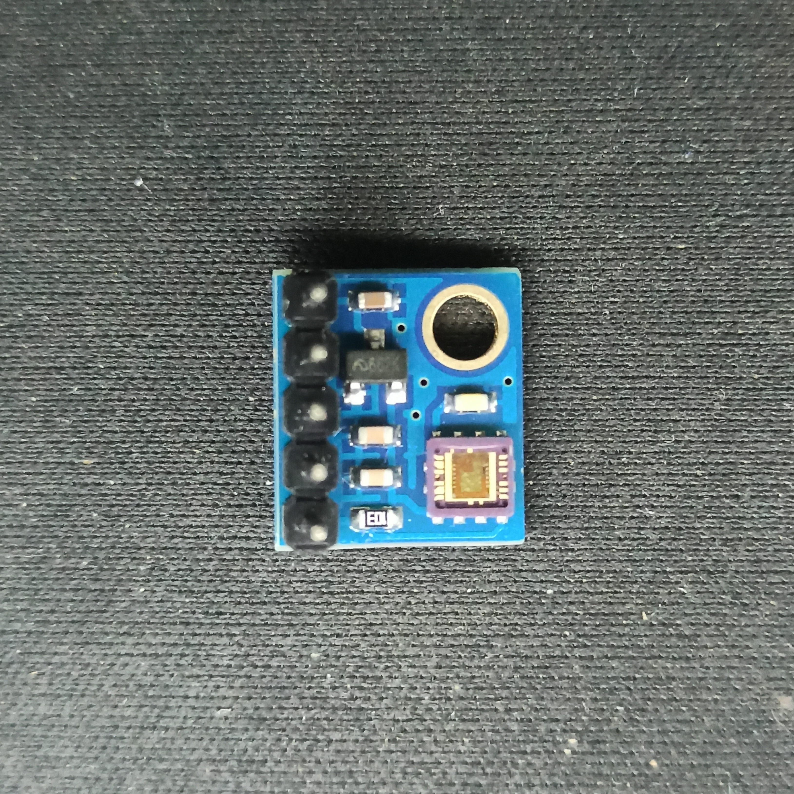
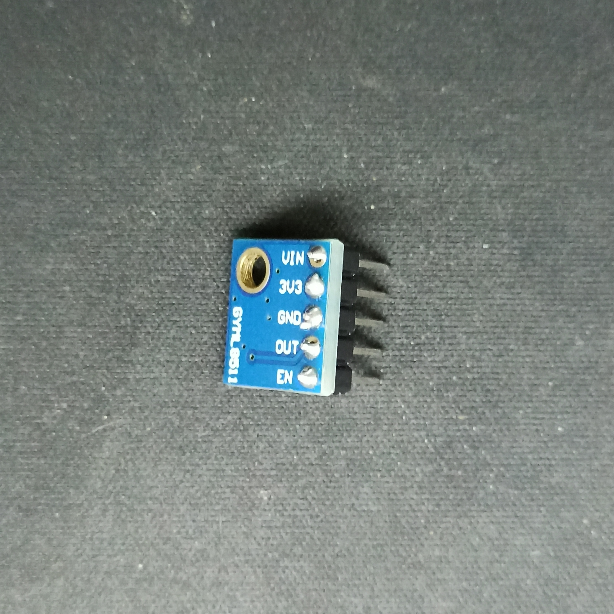

# Propósito

El propósito de este código es la recogida de datos de índice ultravioleta a través de una placa de desarrollo **ESP32** y el sensor **ML8511**, para posteriormente subir esos datos recogidos a una base de datos.

Después de eso, el objetivo era mostrar los datos recogidos en una pagina web, que creamos gratuitamente con **[000webhost](https://000webhost.com/)**, y que tras un gran trabajo de HTML, hecho por mi compañero, conseguimos mostrar dichos datos de forma correcta y visualmente agradable.

Dicha pagina creada por mi compañero con mi ayuda se puede visitar [aquí](https://ultravioletasuperestacion.000webhostapp.com/).  También yo personalmente cree una pagina para mostrar esos datos que se puede visitar [aquí](https://ultravioletasuperestacion.000webhostapp.com/alberto.php).

El posterior objetivo de este proyecto es juntar varios sensores en una misma placa para crear una estación meteorológica que proporcione distintas mediciones de interés.

# Material usado

- **[Kit ESP32](https://www.amazon.es/Freenove-ESP32-WROVER-Included-Compatible-Wireless/dp/B0CJJH2C2C/ref=sr_1_7?adgrpid=55208455845&hvadid=279364096447&hvdev=c&hvlocphy=1005449&hvnetw=g&hvqmt=e&hvrand=4908225397421771884&hvtargid=kwd-403647908158&hydadcr=2892_1744813&keywords=esp32%20kit&qid=1702592440&sr=8-7)**.
- Sensor **[ML8511](https://www.amazon.es/RAKSTORE-GY-8511-ML8511-ruptura-anal%C3%B3gica/dp/B0C39YZT7X/ref=sr_1_2?__mk_es_ES=%C3%85M%C3%85%C5%BD%C3%95%C3%91&crid=3QMW400MGB4SM&keywords=ml8511&qid=1702592480&sprefix=ml8511,aps,96&sr=8-2)**.
- Cables tanto macho/macho como macho/hembra.

## Fotos de dicho material

*Placa de desarrollo ESP32 utilizada.*

*Sensor ML8511 para la medición de datos sobre radiación ultravioleta.*

*Sensor ML8511. Parte trasera.*
# Problemas encontrados

Durante la programación de la placa para recoger información sobre la radiación ultravioleta, mi compañero y yo nos encontramos con distintos problemas que fuimos solventando.

### Conexiones
El primero de ellos fue la colocación de los distintos cables necesitados. Esto parecería algo sencillo a primera vista, pero por alguna razón este sensor requiere una especie de **puente** entre la fuente de 3.3V de la placa, un pin de la placa (que cuya salida será usada en el código como referencia) y el pin **"EN"** (*Enable*) del sensor.
En esta imagen podemos ver un diagrama de conexión bastante claro:

*Créditos: [sparkfun.com](https://learn.sparkfun.com/tutorials/ml8511-uv-sensor-hookup-guide/all)*

### Interpretación de datos
El siguiente problema fue la interpretación de los datos recogidos por el sensor. El ML8511 trabaja usando una especie de sensor sensible a la luz que funciona de la siguiente manera:
> **+ Luz = + Voltaje = + Valor analogico**

El código proporcionado por [How2Electronics](https://how2electronics.com/uv-index-meter-esp32-uv-sensor-ml8511/) resulta proporcionando un valor de intensidad ultravioleta en **mW/cm²**. El problema es que dicho valor no tiene *(a simple vista)* ningún tipo de relación con otras unidades de medición.

Tras un poco de investigación, dimos con un [video](https://www.youtube.com/watch?v=zbHh3onXqBc&t=1231s&ab_channel=RoboticsSpaceNV) que explicaba un proyecto con el ML8511 y un Arduino, y proporcionaba una tabla que relacionaba el valor analógico proporcionado por el sensor y un valor de **índice ultravioleta** *(que es la manera en la que todos los servicios de meteorología proporcionan este dato)*.

Dicha tabla es la siguiente:
| Valor analógico | Índice UV |
|--:|--|
| <50   | 0    |
| <227  | 1    |
| <318  | 2    |
| <408  | 3    |
| <503  | 4    |
| <606  | 5    |
| <696  | 6    |
| <795  | 7    |
| <881  | 8    |
| <976  | 9    |
| <1079 | 10   |
| <1170 | >=11 |

### Interferencias entre canales analógicos
Otro de los problemas que encontramos fue a la hora de introducir la parte de mandar datos a la base de datos en el código de medición.

Para poder usar solicitudes HTTP obviamente necesitamos una conexión a internet, por lo que usamos el módulo **WiFi** que incluye la placa ESP32 integrado, y teníamos conectado el pin de salida analogica del sensor al pin 15, que pertenece al canal analogico 2, **ADC2**, del ESP32 . Lo que no sabíamos es que cuando usamos cualquier tipo de funcionalidad WiFi, dicho canal analogico, ADC2, **quedaria inservible**. Dicho error nos daría problemas durante varios días, ya que estábamos desarrollando el código con el programa [Arduino IDE](https://www.arduino.cc/en/software), el cual no nos indicaba el error de interferencia entre el modulo WiFi y el canal analogico 2.

Cuando hice pruebas en mi ordenador personal, use el entorno de desarrollo [Visual Studio Code](https://code.visualstudio.com/) con la extensión [PlatformIO](https://platformio.org/), y en ese momento fue cuando en el serial monitor pude ver un mensaje que decía que el canal ADC2 ya estaba siendo usado por el modulo WiFi.

La solución ha dicho problema fue conectar la salida del sensor a un pin del canal **ADC1**, que va del pin 32 al pin 39.

# Créditos

- **[Gabriel Abellán](https://github.com/nullmistake)**. Siendo el principal recopilador de información sobre la radiación ultravioleta, ayuda durante la programación del sensor, y un gran trabajo de HTML al crear la pagina para mostrar los datos recogidos por el sensor.
- **[How2Electronics](https://how2electronics.com/uv-index-meter-esp32-uv-sensor-ml8511/)**. Por el código proporcionado para el uso del sensor ML8511 en con la placa ESP32.
- **[Medium](https://chintyaw.medium.com/esp32-project-10-insert-data-into-mysql-database-using-php-and-arduino-ide-84601ed91dc)**. Por el código proporcionado para la creación de la base de datos y su posterior uso con la placa ESP32.